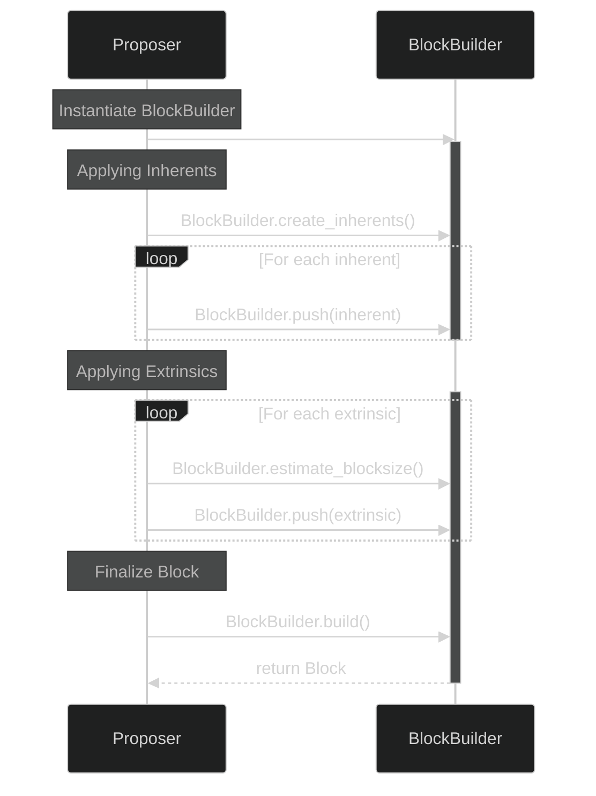
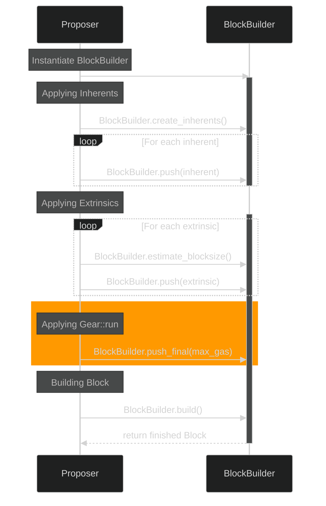

+++
title = 'Gear'
date = 2024-05-31T14:44:26+02:00
draft = true
math = true
+++

# Block Authoring in Vara Network
## 1. Introduction
This article focuses on Gear Protocol's extension of Substrate's `BlockBuilder` implementation. We will be looking at Substrate's native implementation first and afterwards explore how and why Gear Protocol chose to extend it.
## 2. Block Authoring with Substrate
### 2.1 The `BlockBuilder` Utility
The `BlockBuilder` utility is used by the `Proposer` in the Substrate node as an abstraction over the runtime API to initialize a block, push extrinsics, and finalize a block. The `Proposer` leverages the `BlockBuilder` to orchestrate the block production process, ensuring extrinsics are managed and applied correctly, and the block is constructed and finalized properly. An essential part of this process is the bundling of transactions, referred to as extrinsics in Substrate, which include signed transactions, unsigned transactions, and inherent transactions. Inherent transactions, typically just referred to as inherents, are a special type of unsigned transaction. With this type of transaction, block authoring nodes can add information directly to a block. The block authoring process with the `BlockBuilder` utility is depicted in the diagram below in a slightly simplified form.


The important steps where the `Proposer` interacts with the `BlockBuilder` are:
1. **Initialize BlockBuilder**: The `Proposer` initializes a `BlockBuilder` with references to the runtime API and necessary state information.   
2. **Applying Inherents**: Inherent extrinsics are created using the `create_inherents` method and added to the new block using `push`.
3. **Applying Extrinsics**: The `Proposer` then iteratively adds extrinsics from the transaction pool to the block. The `BlockBuilder` interacts with the runtime API to apply each extrinsic to the blockchain state by calling methods like `apply_extrinsic`. This ensures each extrinsic can be validly executed, before including it in the new block. During this process, the `Proposer` uses the `BlockBuilder`'s `estimate_blocksize` method to monitor the current size of the block. The `Proposer` stops adding extrinsics if the block size approaches the block size limit or if the consensus deadline is near.
4. **Finalize Block**: The block is finalized using the `build` method, which completes the block construction and produces the final block structure ready for inclusion in the blockchain.
### 2.2 Time and Size Constraints
When the `Proposer` authors a block using the `BlockBuilder` in Substrate, two key constraints need to be managed: the consensus deadline and block size limit.

The consensus deadline ensures that a block is proposed within a specific timeframe to maintain the overall pace of block production and synchronization across the network. During the block production process, the `Proposer` monitors the time and ensures that the block is finalized and submitted before the deadline. Additionally, a soft deadline is used to provide a secondary timing mechanism to decide when to stop attempting to include more extrinsics into a block. The soft deadline is calculated as a percentage of the remaining time until the consensus deadline, allowing for some flexibility in extrinsics inclusion. The soft deadline therefore provides a buffer period during which the `Proposer` attempts to include a few more extrinsics, even if it has skipped some due to size constraints. In this way the soft deadline ensures that blocks are efficiently filled while adhering to the overall time constraints imposed by the consensus protocol. 

In Substrate the block size is measured in units of `weight`. Substrate defines one unit of weight as one picosecond ($10^{-12}s$) of execution time on reference hardware. The total block size limit is structured further by the introduction of a `DispatchClass` for extrinsics:
```rust
pub enum DispatchClass {
    Normal,
    Operational,
    Mandatory,
}
```
In Substrate the runtime constant `NORMAL_DISPATCH_RATIO` is set to $75\\%$ by default, which means that $75\\%$ of the block weight should be made up by extrinsics of type `DispatchClass::Normal`. The remaining $25\\%$ can be used up by extrinsics of type `DispatchClass::Operational` and `DispatchClass::Mandatory`. Inherents are typically of type `DispatchClass::Mandatory`.

Both time and block size (i.e. weight) constraints are related in the sense that, weight is defined as units of compute per time. Therefore, theoretically, it's possible to measure time in terms of weight, and vice versa. In reality though, this often does not work perfectly and we need both approaches together to maintain consistent block production.

## 3. Block Authoring with `Gear Protocol`
### 3.1 Custom `BlockBuilder` Implementation in Gear Protocol
In Gear Protocol there exists a special inherent called `Gear::run` (the "pseudo-inherent"), which is responsible for processing Gear's message queue. In Gear Protocol messages serve as the primary interface for communication between actors (users and programs). Each Gear program includes code to handle incoming messages. During the processing of these messages, programs can send messages to other programs or users, including replies to the original message. Gear nodes maintain a global message queue. Users can send transactions containing one or more messages to specific programs via a Gear node, which populates the message queue. During block authoring, messages are dequeued and delivered to their respective programs.

The `Gear::run` pseudo-inherent must be added at the end of each block after all other extrinsics have been pushed. Furthermore, to ensure consistent block production, this pseudo-inherent must not exceed the block proposing deadline defined by the node client. To account for these requirements, Gear Protocol extended Substrate's `BlockBuilder` and `Proposer` implementations. The diagram below highlights the changes as opposed to Substrate's native implementation.



As an additional step, the `push_final` method is called to fetch the pseudo-inherent via the runtime API and push it to the end of the block's list of extrinsics. The `max_gas` parameter is used to adjust the gas budget for `Gear::run`.

Explain these three concepts in the text and then you're finished:
- `max_gas: Option<u64>`,
- `deadline_slippage: DurationMultiplier`,
- `dispatch_ratio: DurationMultiplier`

- Mention Vara network
- `Gear::run()`: https://docs.gear.rs/src/pallet_gear/lib.rs.html#1574
## 4. Advantages
- Enables messages which can be used for example for: delayed program execution(?)